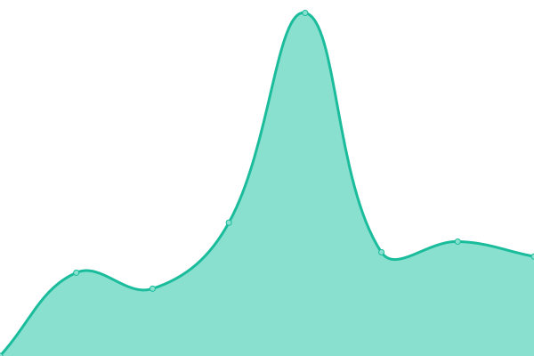

# [📈 Live Status](https://status.haeckl-it.de): <!--live status--> **🟧 Partial outage**

This repository contains the open-source uptime monitor and status page for [Max H.](https://status.haeckl-it.de), powered by [Upptime](https://github.com/upptime/upptime).

With [Upptime](https://upptime.js.org), you can get your own unlimited and free uptime monitor and status page, powered entirely by a GitHub repository. We use [Issues](https://github.com/8ear/upptime/issues) as incident reports, [Actions](https://github.com/8ear/upptime/actions) as uptime monitors, and [Pages](https://status.haeckl-it.de) for the status page.

<!--start: status pages-->
<!-- This summary is generated by Upptime (https://github.com/upptime/upptime) -->
<!-- Do not edit this manually, your changes will be overwritten -->
<!-- prettier-ignore -->
| URL | Status | History | Response Time | Uptime |
| --- | ------ | ------- | ------------- | ------ |
|  Mailsystem External | 🟩 Up | [mailsystem-external.yml](https://github.com/8ear/upptime/commits/HEAD/history/mailsystem-external.yml) | 

 870ms
     
 | 

<a href="https://status.haeckl-it.de/history/mailsystem-external">100.00%</a>
    

|  Mailsystem Internal | 🟩 Up | [mailsystem-internal.yml](https://github.com/8ear/upptime/commits/HEAD/history/mailsystem-internal.yml) | 

 4721ms
     
 | 

<a href="https://status.haeckl-it.de/history/mailsystem-internal">97.85%</a>
    

|  WP Sweetdeco | 🟩 Up | [wp-sweetdeco.yml](https://github.com/8ear/upptime/commits/HEAD/history/wp-sweetdeco.yml) | 

 1359ms
     
 | 

<a href="https://status.haeckl-it.de/history/wp-sweetdeco">100.00%</a>
    

|  WP Praxis | 🟩 Up | [wp-praxis.yml](https://github.com/8ear/upptime/commits/HEAD/history/wp-praxis.yml) | 

 795ms
     
 | 

<a href="https://status.haeckl-it.de/history/wp-praxis">100.00%</a>
    

|  WP Matomo | 🟥 Down | [wp-matomo.yml](https://github.com/8ear/upptime/commits/HEAD/history/wp-matomo.yml) | 

 640ms
     
 | 

<a href="https://status.haeckl-it.de/history/wp-matomo">0.00%</a>
    

|  WP Hochzeit | 🟩 Up | [wp-hochzeit.yml](https://github.com/8ear/upptime/commits/HEAD/history/wp-hochzeit.yml) | 

 674ms
     
 | 

<a href="https://status.haeckl-it.de/history/wp-hochzeit">100.00%</a>
    

|  Speedtest | 🟩 Up | [speedtest.yml](https://github.com/8ear/upptime/commits/HEAD/history/speedtest.yml) | 

 489ms
     
 | 

<a href="https://status.haeckl-it.de/history/speedtest">100.00%</a>
    

|  R G | 🟩 Up | [r-g.yml](https://github.com/8ear/upptime/commits/HEAD/history/r-g.yml) | 

 1293ms
     
 | 

<a href="https://status.haeckl-it.de/history/r-g">100.00%</a>
    

|  R B | 🟩 Up | [r-b.yml](https://github.com/8ear/upptime/commits/HEAD/history/r-b.yml) | 

 1281ms
     
 | 

<a href="https://status.haeckl-it.de/history/r-b">99.84%</a>
    

|  R K | 🟩 Up | [r-k.yml](https://github.com/8ear/upptime/commits/HEAD/history/r-k.yml) | 

 1707ms
     
 | 

<a href="https://status.haeckl-it.de/history/r-k">96.89%</a>
    

|  R A | 🟩 Up | [r-a.yml](https://github.com/8ear/upptime/commits/HEAD/history/r-a.yml) | 

 1161ms
     
 | 

<a href="https://status.haeckl-it.de/history/r-a">99.22%</a>
    

<!--end: status pages-->

[**Visit our status website →**](https://status.haeckl-it.de)

## 📄 License

- Powered by: [Upptime](https://github.com/upptime/upptime)
- Code: [MIT](./LICENSE) © [Max H.](https://status.haeckl-it.de)
- Data in the `./history` directory: [Open Database License](https://opendatacommons.org/licenses/odbl/1-0/)
